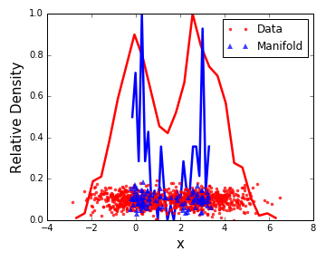
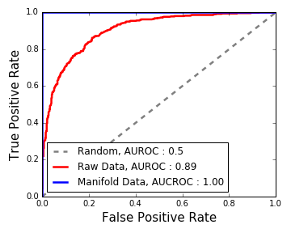
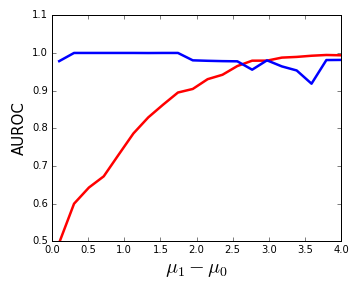

Optimal Represenation of Single Cell Data
============================
An implementation of Chigirev and Bialek 2003

Purpose
-------

This repository is a simple implementation of a an algorithm established by Chigirev and Bialek in NIPs (2003).  I find this method valuable for its ability to to find optimal represenations of data, even data that are highly nonlinear.  The algorithm's goal is to find the lower dimensional manifold that is responsible for producing the data.

An interesting application is in finding the opitmal representation of data consisting of mixtures of populations.  In this scenario, the optimal manifold description would consists of points about the mode of each mixture component.  Consequently, the number of mixture distributions and their respective positions in the data space become more apparent.

The task of finding the mixture distributions in data are commonplace in studying biology.  Individuals are often tasked to find subpopulations of cells in data that can be both high dimensional and noisy.  The dimensionality of the problem makes it difficult, or effectively impossible, to manually parse the data in search of subpopulations.  In addition, the diversity of biomolecule abundance, e.g. protein and the variability originating from intrinsic properties of cells, obscures identification of unique populations.  Together, application of digital computation is essential to extract useful insights.

In this example, I present simulated data that highlights the aforementioned application.  I use these simulations to show how finding points on the optimal manifold provides a means to identify populations of cells with high sensitivity.  Lastly, I use this as an example for people interested in applying this technique to their own real data.

Example, Identifying mixtures of Gaussian Distributions
-------------------------------------------------------

Consider samples of two Gaussian distributions, in which their means are designated as m0 and m1, with a distance between them, D (Figure 1, Below).  When applying the algorithm to the simulated data, we see that the optimal points found are concentrated near the modes of the respective Gaussian components.

We can systematically measure the performance of this representation by applying techniques used to study binary classification methods.  In this problem, each data point has a label, "0" if sampled from the 0th Gaussian mixture (m0 = 0), and "1" if sampled from the 1st Gaussian (m1 = D + m0 = D).  We then compute the Receiver Operating Characteristic (ROC), by plotting the False Postive vs, the True Positive Rates in estimating the correct label.

We can can quantify the ability of a binary classifier by computing the Area Under the ROC (AUROC).  Random samples will have an AUROC = 0.5, and while perfect classification would have an AUROC = 1.

